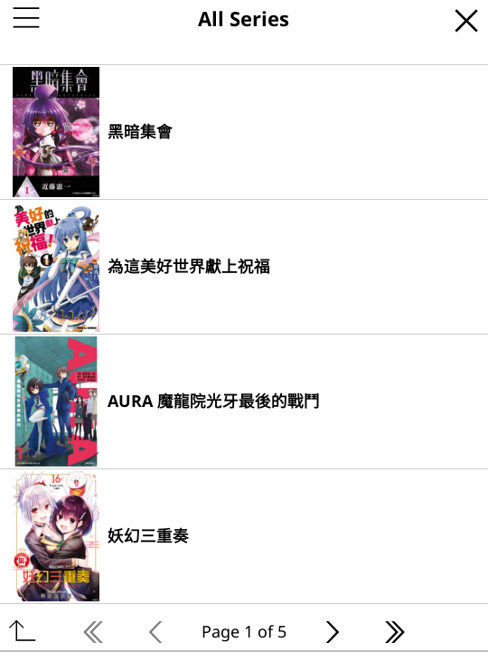
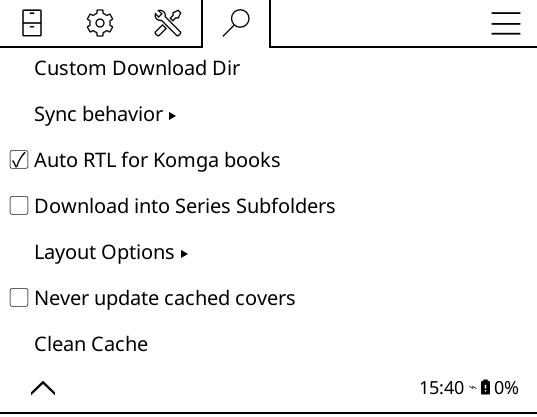

# KOReader Komga Client Plugin (kokomga)

A KOReader plugin that connects to your Komga server. It provides a native library browser to check your Komga catalog, download books directly to your device, and keep your reading progress perfectly synchronized.

## Highlights

* **Direct Catalog Browsing**: Explore your entire Komga server—including libraries, recently added, and on-deck books—with cover thumbnails, list or grid views, and read status filters.
* **Hands-Free Syncing**: Keep your reading progress in sync directly with your Komga server, without needing to configure it as a KOSync server.
* **Background Pre-Downloading**: Pre-download the next $N$ chapters sequentially in the background while reading. Optionally toggle `Skip end-of-book prompt` to directly open the next book as soon as you finish the current one for an uninterrupted reading flow.
* **Smart Next-Chapter Transition**: When you turn the last page, the plugin can instantly open the next book if it's already on your device, or download and open it automatically over Wi-Fi.
* **Automatic Book & Folder Metadata**: Downloads automatically fetch rich metadata (authors, summaries, and series indexes) and save folder cover art for file browser plugins.
* **Bulk Downloads**: Easily queue multiple books or download all remaining unread books in a series directly from the browser view.
* **Auto RTL for Manga**: Automatically sets your reading layout to Right-to-Left (RTL) when opening manga matched with your Komga server.

---

## Documentation

For detailed installation guides, configuration walk-throughs, troubleshooting, and feature deep-dives, please visit our [**GitHub Wiki**](https://github.com/JimDBh/kokomga.koplugin/wiki).

---

## Screenshots

*(Note: The screenshots below are for reference and may not exactly reflect the newest version)*

<table>
  <tr>
    <th width="50%">Browser Grid View</th>
    <th width="50%">Browser List View</th>
  </tr>
  <tr>
    <td></td>
    <td></td>
  </tr>
  <tr>
    <th>Setup &amp; Settings</th>
    <th>Auto-Download Next Chapter</th>
  </tr>
  <tr>
    <td></td>
    <td></td>
  </tr>
</table>

